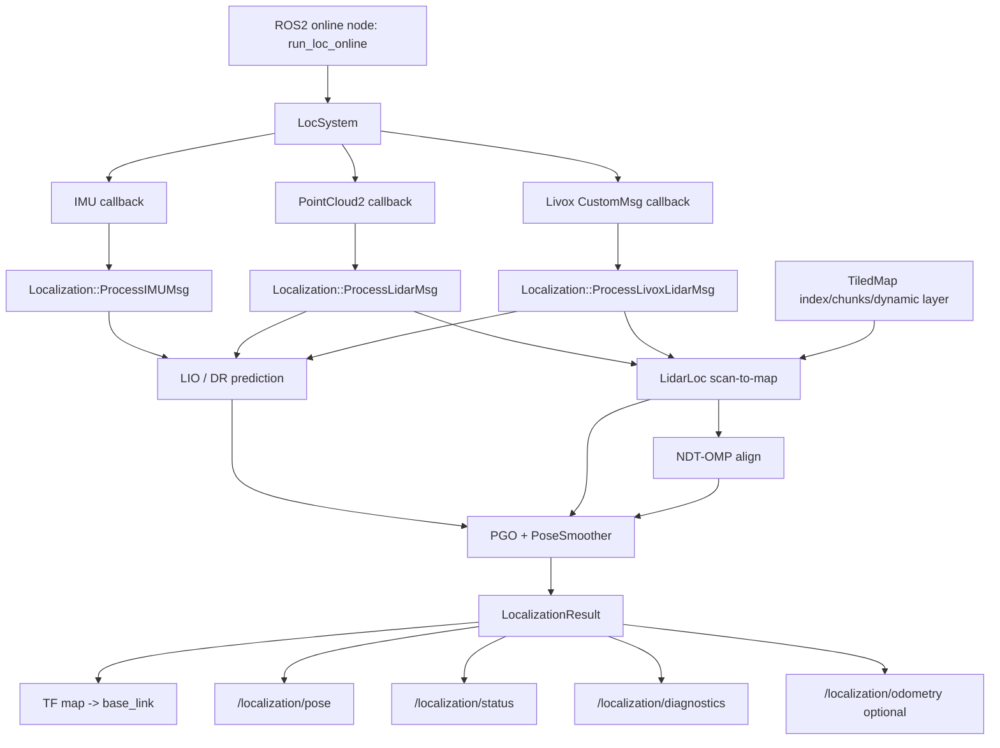
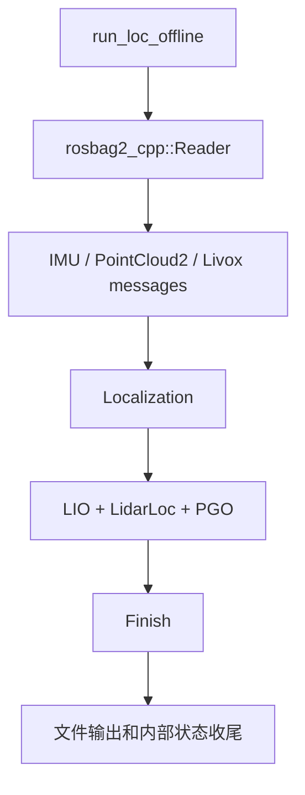

# lightning_localization 技术路线与算法实现说明

检索日期：2026-06-04  
审计方式：源码静态审计、配置审计、构建文件审计和官方公开资料检索。当前 Windows 环境未执行 ROS2 编译、节点运行、rosbag 回放、RViz2 或 Pangolin 验证。

## 总体技术路线

`lightning_localization` 当前延续原 lightning-lm 的定位主链路：以 IMU + LiDAR 输入为基础，LIO 前端提供短时运动预测，`LidarLoc` 使用 NDT-OMP 做 scan-to-map 匹配，`PGO` 和 `PoseSmoother` 负责融合、平滑和高频外推，`LocSystem` 负责 ROS2 输入输出。阶段一补强没有改变默认定位算法，也没有引入新的匹配后端。

核心路线可以概括为：

1. ROS2 在线入口接收 IMU 与 LiDAR。
2. 点云转换为内部点类型并进入 LIO 与定位处理。
3. LIO/DR 提供当前位姿初值。
4. `TiledMap` 根据当前位姿加载局部 map chunk 并设置 NDT target。
5. `LidarLoc::Localize()` 执行 NDT-OMP scan-to-map。
6. `PGO` 融合 DR/LIO 与 LidarLoc 结果，平滑并外推高频定位结果。
7. 输出 TF、PoseStamped、status、diagnostics 和可选 Odometry。

## 数据流图

离线入口不经过 `LocSystem`，因此不创建上述 ROS2 topic publisher：

## 坐标系和 frame

| 输出 | frame 语义 | 静态结论 |
| --- | --- | --- |
| TF | `map -> base_link` | `LocalizationResult::ToGeoMsg()` 固定使用 `map` 与 `base_link`。 |
| `/localization/pose` | `header.frame_id=ros_output.map_frame` | 默认 `map`，可通过 YAML 修改。 |
| `/localization/odometry` | `header.frame_id=ros_output.map_frame`，`child_frame_id=ros_output.base_frame` | 默认 `map/base_link`，odometry 默认关闭。 |
| diagnostics | `frame_id`、`child_frame_id` 作为 KeyValue 输出 | 默认 `map/base_link`。 |

注意：topic frame 可配置不等价于 TF frame 可配置。若阶段二需要统一 frame 配置，必须保持默认 `map -> base_link` 不变，并增加兼容性检查。

## 时间戳处理

`LocalizationResult.timestamp_` 是定位结果时间戳，`LocSystem::ToRosTime(double timestamp)` 将其转换为 ROS2 时间，使用秒整数部分和纳秒小数部分，避免直接丢弃小数。Pose、diagnostics、odometry 均使用该时间。status 使用字符串包含 timestamp。

需要人工验证的部分：

| 项 | 原因 |
| --- | --- |
| bag time / sim time 行为 | 当前无法运行 ROS2 clock。 |
| 高频输出时间是否单调 | 需 rosbag 压力回放。 |
| TF cache 与 topic stamp 是否一致 | 需 RViz2/tf2_echo 验证。 |

## 点云格式统一

标准 `sensor_msgs/msg/PointCloud2` 和 Livox `CustomMsg` 在进入 `Localization` 后转换为内部 `CloudPtr`。点云处理流程包含裁剪、滤波、LIO 前端处理和 LidarLoc scan-to-map。当前实现保留原链路，但没有产品级输入 schema 检查，例如点字段存在性、强度/时间字段、ring 字段、传感器 profile、坐标外参一致性和异常点比例诊断。

## LIO 预测和里程计

LIO 前端承担短时运动预测和 DR/lidar odom 角色，PGO 使用其结果提高高频输出连续性。该路线的优点是低延迟和持续输出，风险是 LIO 退化或 IMU 外参错误时会把错误初值传给 NDT-OMP，当前没有统一 failure reason 和退化检测来解释失败根因。

## scan-to-map 匹配

`LidarLoc` 使用 `TiledMap` 当前局部地图作为 target，输入当前 scan 和 LIO/DR 初值，调用 NDT-OMP align。匹配完成后使用 final transformation 更新 pose，并记录 transformation probability 作为 confidence。

当前 scan-to-map 链路具备：

| 能力 | 状态 |
| --- | --- |
| 局部地图动态加载 | 已静态确认。 |
| NDT-OMP target 更新 | 已静态确认，`TiledMap::SetNewTargetForNDT()`。 |
| 粗匹配 NDT | 已静态确认。 |
| LO 初值 | 已静态确认。 |
| 多候选回退 | 代码有痕迹，但策略不完整。 |
| failure reason | 未形成结构化输出。 |

## NDT-OMP 参数和调用流程

NDT-OMP 配置位于 `LidarLoc` 初始化：

| 参数 | 说明 |
| --- | --- |
| `ndt_resolution` | target voxel 分辨率，默认 1.0。 |
| `DIRECT7` | 邻域搜索策略。 |
| `outlier_ratio` | 默认 0.45。 |
| `step_size` | 默认 0.1。 |
| `transformation_epsilon` | 默认 0.01。 |
| `max_iterations` | 默认 20。 |
| `num_threads` | 默认 4。 |
| `rough_ndt_resolution` | 粗匹配默认 5.0。 |

调用流程：

1. 点云预处理后设置 source。
2. `TiledMap` 更新 target。
3. 使用预测位姿作为 initial guess。
4. 调用 `ndt->align()`。
5. 读取 final transformation 和 transformation probability。
6. 更新 `LocalizationResult` 相关字段。

当前风险是 success/quality 判定与 `hasConverged()`、fitness/residual、inlier ratio、退化方向、协方差之间没有统一结果结构。

## 初始化逻辑

在线入口启动后调用 `SetInitPose(SE3())` 设置单位初始位姿。`LidarLoc` 也支持从 recover pose 和功能点路线初始化。代码中存在 `InitWithFP()`、`YawSearch()`、`Align()` 等函数，但产品级全局重定位和多源初始化接口尚不完整。

阶段二应把初始化拆成：

| 初始化来源 | 建议 |
| --- | --- |
| 外部 pose | 通过 service/action 明确注入，并输出状态。 |
| recover pose | 校验时间、地图 hash 和 pose 合法性。 |
| 功能点/全局搜索 | 输出候选数、score、失败原因和耗时。 |
| 手动 RViz pose | 接入 ROS2 service 或标准 initialpose topic 时保留默认行为。 |

## 重定位能力现状

静态审计显示 `LocCmd.srv` 存在，但未确认 `LocSystem` 注册完整 runtime service。`SetInitPose()`、`SetExternalPose()`、recover pose 和功能点初始化能力存在，但还不是产品级可观测、可配置、可回滚的重定位系统。

重定位短板：

| 项 | 当前状态 |
| --- | --- |
| 外部命令入口 | service 定义存在，runtime 注册不足。 |
| 全局候选搜索 | 有功能点/粗匹配能力，但缺少统一接口。 |
| 成功率统计 | 未实现。 |
| failure reason | 未结构化。 |
| 回滚策略 | 未形成状态机。 |

## PGO / smoother

`PGO` 管理 DR、LIO、LidarLoc 结果队列，`PoseSmoother` 对输出做平滑并限制突变。PGO 高频输出回调是 TF 和 topic 的真实数据源。当前实现适合阶段一功能复用，但工业级需要补齐 covariance、时间同步策略、异常输入隔离、输出状态机和评估指标。

## confidence / status / diagnostics

`LocalizationResult` 包含 `status_`、`valid_`、`lidar_loc_valid_`、`confidence_`、`lidar_loc_odom_delta_`、`lidar_loc_odom_error_normal_`、`lidar_loc_smooth_flag_`、`is_parking_`。topic 补强把这些字段输出到 status 字符串和 diagnostics KeyValue。

当前语义边界：

| 字段 | 当前语义 | 阶段二建议 |
| --- | --- | --- |
| confidence | NDT transformation probability | 保留为 backend raw score，同时增加统一 score。 |
| valid | 当前结果是否可用于 pose-like 输出 | 增加 failure reason 和 state transition。 |
| lidar_loc_valid | scan-to-map 是否有效 | 与 LIO/DR 退化分离。 |
| diagnostics level | GOOD+valid 为 OK，初始化/DR/invalid 为 WARN，FAIL 为 ERROR | 增加可配置阈值和统计窗口。 |

## 地图格式

当前地图使用 `index.txt` 管理 tiled map chunk，结合静态层、动态层和功能点。地图数据按 chunk 加载并设置为 NDT target。工业化上应补充 metadata 文件，至少包含：

| metadata 字段 | 目的 |
| --- | --- |
| schema_version | 兼容性检查。 |
| map_frame | 与 TF/topic frame 对齐。 |
| map_origin | 复核 `index.txt` 原点。 |
| chunk_count | 检查缺失 chunk。 |
| hash/checksum | 检查数据损坏。 |
| build_config | 记录建图参数。 |
| sensor_profile | 记录建图传感器来源。 |

## 运行入口

| 入口 | 作用 | 当前边界 |
| --- | --- | --- |
| `run_loc_online` | ROS2 在线定位，创建 `LocSystem` | 待 ROS2 环境运行验证。 |
| `run_loc_offline` | rosbag 离线定位，直接用 `Localization` | 不发布新增 ROS2 topic。 |
| launch 文件 | 组织 ROS2 启动参数 | 待 ROS2 环境验证。 |

## 与原 lightning-lm 行为一致性

阶段一独立包保留了原定位主链路和默认 NDT-OMP 路线。topic 补强接入在 `LocSystem` result callback，不替换 `Localization`、`LidarLoc`、PGO 或 TF callback。未发现阶段二后端抽象、small_gicp、fast_gicp、VGICP、gtsam_points 接入或默认算法替换。

## 算法优点

| 优点 | 说明 |
| --- | --- |
| 默认链路成熟 | 继承原 lightning-lm LIO + NDT-OMP + PGO 路线。 |
| 大地图友好 | TiledMap 动态加载适合较大场景。 |
| 高频输出 | PGO 和 smoother 支持比 scan-to-map 更高频的平滑 pose。 |
| 动态层能力 | 保留静态/动态层定位路线。 |
| ROS2 输出补强 | 现在具备标准 PoseStamped、DiagnosticArray 和可选 Odometry。 |

## 算法风险

| 风险 | 影响 |
| --- | --- |
| confidence 语义单一 | transformation probability 不能覆盖退化、残差、协方差和可观测性。 |
| NDT success 判定不完整 | 可能把低质量或未收敛结果包装为可用结果。 |
| 默认 debug 写盘 | 高频路径写 PCD 会影响实时性和磁盘寿命。 |
| 地图 metadata 缺失 | 难以识别 map/config/bag 不匹配。 |
| service/lifecycle 不完整 | 不利于产品级远程控制和故障恢复。 |
| 可选后端未隔离 | 阶段二若直接改 `Localize()`，容易破坏默认 NDT-OMP 回归。 |

## 静态审计结论

当前 `lightning_localization` 已具备阶段一独立定位包和 topic 输出补强的源码基础。建议进入阶段二规划和小步实现，但进入阶段二前应优先修复或明确以下高风险项：默认 debug 写盘、runtime service 边界、地图 metadata/chunk 校验、NDT 匹配结果质量结构、配置 schema 和人工 ROS2 验证日志。ROS2 编译和运行验证尚未执行，必须在 Ubuntu/ROS2/colcon 环境完成。
